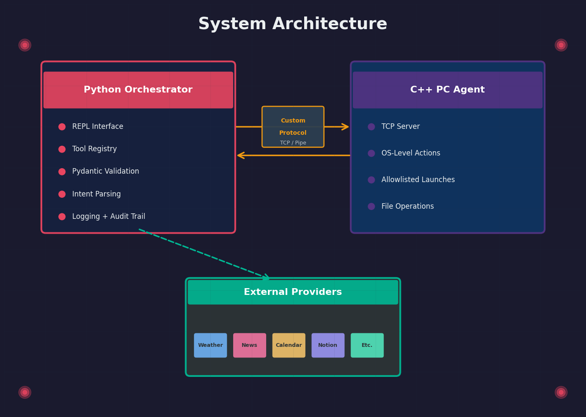

# ATLAS

A local-first personal assistant built for real daily use, and built from scratch as a serious engineering project.

ATLAS is an intent router and tool runner: every action is an explicit, validated, logged tool. No guessing, no magic. Commands come in (typed now, voice later), get parsed, validated, confirmed if sensitive, and executed deterministically.

> **Status:** Phase 0 - Foundations (in progress)

---

## Why This Exists

I'm a game programmer (C/C++, UE5) targeting Systems and Network programming roles. ATLAS exists to solve two problems at once:

1. **I want a personal assistant I actually control.** Local-first, no cloud lock-in, no subscriptions. Something that launches my apps, manages my calendar, controls my lights, and sends messages, all through one interface.
2. **I want portfolio work that demonstrates systems thinking.** Multi-process architecture, IPC, custom protocol design, socket-level networking, the things Systems and Network recruiters actually look for.

This isn't a weekend hack. It's an incremental build with formal architecture decisions, phase gates, and tests at every step.

---

## Architecture



The Python orchestrator handles intent routing, validation, and logging. The C++ PC Agent (arriving in Phase 2) handles OS-level actions over a custom local protocol. The protocol boundary is the point. It's where the systems engineering lives.

---

## Current State

### What's built
- Monorepo structure with component separation (`orchestrator/`, `pc_agent/`, `shared/`)
- All foundational architecture decisions made and documented
- Dev tooling selected: uv, Ruff, mypy, pytest

### What's in progress (Phase 0)
- Python REPL that dispatches typed commands through a Pydantic-validated tool registry
- Three stub tools (`util.calculate`, `pc.open_url`, `pc.open_app`) that log intent without performing real actions
- Structured logging

### What's ahead
| Phase | Focus |
|-------|-------|
| 0 | Foundations: REPL, registry, schemas, logging, stubs |
| 1 | Real local tools: calc, time, weather, news |
| 2 | C++ PC Agent v1: TCP server, custom protocol, cross-process tools |
| 3 | Agent hardening: allowlists, reconnection, protocol versioning, audit |
| 4 | Sensitive operations: confirmation gates, PIN, dry-run, calendar/Notion |
| 5 | Communication: email, WhatsApp, Discord (preview-and-confirm) |
| 6 | Polish + portfolio prep: docs, demo, coverage, recruiter-ready |
| 7+ | Hardware: Raspberry Pi, NAS, voice, smart lights, Wake-on-LAN |

---

## Tech Stack

| Component | Choice | Why |
|-----------|--------|-----|
| Orchestrator | Python (stdlib `cmd` + Pydantic) | Best ecosystem for intent routing; hand-written parser transfers to voice input later |
| PC Agent | C++ (deferred to Phase 2) | Resume signal for Systems/Network roles; native OS access |
| IPC | Custom protocol over TCP/named pipe | The highest-value artifact: demonstrates protocol design, framing, lifecycle |
| Dependency management | uv | Fast, modern, single-tool venv + deps + project init |
| Linting + formatting | Ruff | Single Rust binary, millisecond feedback, ecosystem standard |
| Type checking | mypy | Static analysis for a dynamically typed language |
| Testing | pytest | Industry default, clear failures, plugin ecosystem |
| Version control | GitHub Flow | Feature branches into stable `main` |

---

## Project Structure

```
Project-Atlas/
├── orchestrator/          # Python: intent routing, validation, tools, REPL
│   ├── src/
│   ├── tests/
│   ├── config/
│   └── pyproject.toml
├── pc_agent/              # C++: OS-level actions (Phase 2+)
├── shared/                # Protocol spec, shared schemas, cross-component contracts
├── docs/
├── DECISIONS.md           # Formal architecture decision log
├── PROJECT-STATE.md       # Live phase status tracker
└── README.md
```

---

## Security Model

Every tool has a sensitivity level. Nothing destructive happens silently.

| Level | Examples |
|-------|----------|
| No confirmation | Weather, news, calculations, open allowlisted app |
| Confirm required | Calendar writes, Notion writes, media autoplay, drafting messages |
| Confirm + optional PIN | Send email, send WhatsApp/Discord, destructive file operations |

Additional safeguards: app allowlist, directory allowlist, mandatory preview before any send, dry-run mode.

---

## Documentation

- [`DECISIONS.md`](DECISIONS.md): every architectural decision with alternatives considered and reasoning
- [`PROJECT-STATE.md`](PROJECT-STATE.md): current phase, completed work, next action

---

## License

*TBD*