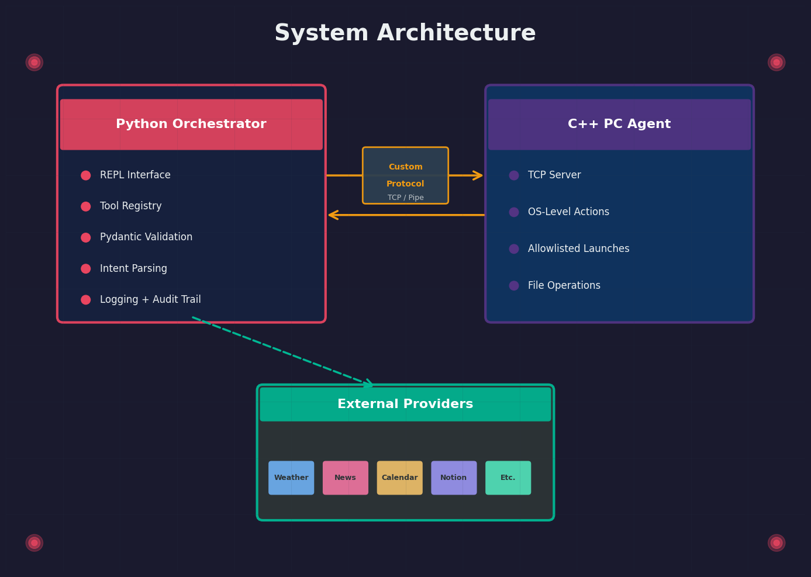

# ATLAS

A local-first personal assistant built for real daily use, and built from scratch as a serious engineering project.

ATLAS is an intent router and tool runner: every action is an explicit, validated, logged tool. No guessing, no magic. Commands come in (typed now, voice later), get parsed, validated, confirmed if sensitive, and executed deterministically.

ATLAS is open source and extensible. The core ships, and users write their own agents and wire them in without modifying the core.

> **Status:** Phase 0 - Foundations (in progress)

---

## Why This Exists

I'm a game programmer (C/C++, UE5) targeting Systems and Network programming roles. ATLAS exists to solve two problems at once:

1. **I want a personal assistant I actually control.** Local-first, no cloud lock-in, no subscriptions. Something that launches my apps, manages my calendar, controls my lights, and sends messages, all through one interface.
2. **I want portfolio work that demonstrates systems thinking.** Multi-process architecture, IPC, custom protocol design, socket-level networking, the things Systems and Network recruiters actually look for.

This isn't a weekend hack. It's an incremental build with formal architecture decisions, phase gates, and tests at every step.

ATLAS stays a personal assistant that each user runs on their own machine. It is not a hosted service, product, or company. The orchestration is the portfolio; the agents are the demo that proves it is real and general.

---

## Architecture



The orchestrator exposes a single **Tool registry**. Every capability is a Tool behind one interface, regardless of where the work happens. The registry is the seam the whole system hangs from: from the orchestrator's view, watering a plant and fetching the weather are both just Tools, and the registry does not care how each one does its job. That indifference is what makes ATLAS extensible.

Three boundaries hang off the registry:

- **Boundary A (outbound, owned):** a hand-written custom binary protocol to native agents and processes I control (the C++ PC Agent, the Poseidon controller).
- **Boundary B (outbound, external):** an adapter layer that binds any external REST API to a custom command, with my own adapter and manifest design.
- **Boundary C (inbound):** a command surface accepting input from a remote network client now, and voice later.

The Python orchestrator handles intent routing, validation, and logging. The C++ PC Agent (arriving in Phase 2) handles OS-level actions over Boundary A. The protocol boundary is the point. It's where the systems engineering lives.

---

## Agents

Agents are capabilities built on top of the Tool registry. They demonstrate that the orchestration is general across different domains. The planned set:

| Agent | Domain | What it does |
|-------|--------|--------------|
| **Plutus** | Personal finance | Expense tracking, categorization, monthly reports with charts by sector, cashflow and savings forecasting. Market data is surfaced as information only. |
| **Poseidon** | IoT | Plant watering on a self-built ESP32/Arduino controller with custom firmware, commanded over the network. |
| **Athena** | News | Personalized news from APIs and RSS, summarized and scheduled, consumed through the standard tool interface. |
| **Zeus** | Weather | Voice-driven. Reads back current conditions and the official forecast, including rain and snow probabilities reported honestly with their uncertainty. Built on top of the existing weather tool. |

---

## Current State

### What's built
- Monorepo structure with component separation (`orchestrator/`, `pc_agent/`, `shared/`)
- All foundational architecture decisions made and documented
- Dev tooling selected: uv, Ruff, mypy, pytest
- Tool abstract base class with a Template Method pattern (`run()` validates, `_execute()` acts)
- Three stub tools with Pydantic input models and structured logging

### What's in progress (Phase 0)
- Python REPL that dispatches typed commands through a Pydantic-validated tool registry
- Three stub tools (`util.calculate`, `pc.open_url`, `pc.open_app`) that log intent without performing real actions
- Structured logging

### What's ahead
| Phase | Focus |
|-------|-------|
| 0 | Foundations: REPL, registry, schemas, logging, stubs |
| 1 | Real local tools: calc, time, weather, news |
| 2 | C++ PC Agent v1: TCP server, custom protocol, cross-process tools |
| 3 | Agent hardening: allowlists, reconnection, protocol versioning, audit |
| 4 | Sensitive operations: confirmation gates, PIN, dry-run, calendar/Notion |
| 5 | Communication: email, WhatsApp, Discord (preview-and-confirm) |
| 6 | Polish + portfolio prep: docs, demo, coverage, recruiter-ready |
| 7+ | Hardware: Raspberry Pi, NAS, voice, smart lights, Wake-on-LAN |

---

## Tech Stack

| Component | Choice | Why |
|-----------|--------|-----|
| Orchestrator | Python (stdlib `cmd` + Pydantic) | Best ecosystem for intent routing; hand-written parser transfers to voice input later |
| PC Agent | C++ (deferred to Phase 2) | Resume signal for Systems/Network roles; native OS access |
| IPC | Custom protocol over TCP/named pipe | The highest-value artifact: demonstrates protocol design, framing, lifecycle |
| Dependency management | uv | Fast, modern, single-tool venv + deps + project init |
| Linting + formatting | Ruff | Single Rust binary, millisecond feedback, ecosystem standard |
| Type checking | mypy | Static analysis for a dynamically typed language |
| Testing | pytest | Industry default, clear failures, plugin ecosystem |
| Version control | GitHub Flow | Feature branches into stable `main` |

The language split is layer-based, not percentage-mandated: agent and orchestration work lives in Python where the ecosystem is strongest, and low-level protocol-bound work lives in C++. Each layer uses the right tool, and the learning stays sequenced instead of stacking every hard thing at once.

---

## Project Structure

```
Project-Atlas/
├── orchestrator/          # Python: intent routing, validation, tools, REPL
│   ├── src/
│   ├── tests/
│   ├── config/
│   └── pyproject.toml
├── pc_agent/              # C++: OS-level actions (Phase 2+)
├── shared/                # Protocol spec, shared schemas, cross-component contracts
├── docs/
├── DECISIONS.md           # Formal architecture decision log
├── PROJECT-STATE.md       # Live phase status tracker
└── README.md
```

---

## Security Model

Every tool has a sensitivity level. Nothing destructive happens silently.

| Level | Examples |
|-------|----------|
| No confirmation | Weather, news, calculations, open allowlisted app |
| Confirm required | Calendar writes, Notion writes, media autoplay, drafting messages |
| Confirm + optional PIN | Send email, send WhatsApp/Discord, destructive file operations |

Additional safeguards: app allowlist, directory allowlist, mandatory preview before any send, dry-run mode.

---

## Documentation

- [`DECISIONS.md`](DECISIONS.md): every architectural decision with alternatives considered and reasoning
- [`PROJECT-STATE.md`](PROJECT-STATE.md): current phase, completed work, next action

---

## License

MIT. See [`LICENSE`](LICENSE.txt) for the full text. You may use, modify, and build on ATLAS, including in closed or commercial products, with attribution as the only obligation.